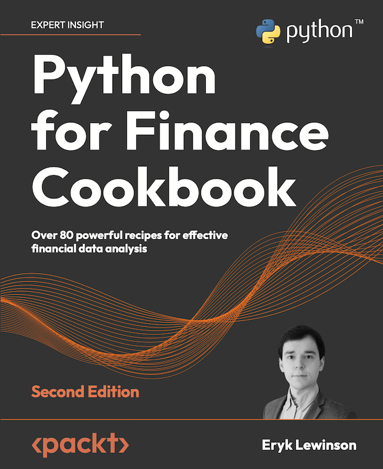

# Python for Finance Cookbook 2nd Edition - Code Repository

**Python For Finance Cookbook, 2nd Edition**  

Publication date: December 30th, 2022

Paperback: 740 pages  
Publisher: Packt Publishing  
Language: English

## Links

- [Amazon Page](https://amzn.to/3YYJPG6)
- [Packt Page](https://www.packtpub.com/product/python-for-finance-cookbook-second-edition/9781803243191)

## Table of Contents

1. Acquiring Financial Data
2. Data Preprocessing
3. Visualizing Financial Time Series
4. Exploring Financial Time Series Data
5. Technical Analysis and Building Interactive Dashboards
6. Time Series Analysis and Forecasting  
7. ML-based Approaches to Time Series Forecasting
8. Multi-Factor Models
9. Modeling Volatility with GARCH Class Models
10. Monte Carlo Simulations in Finance
11. Asset Allocation
12. Backtesting Trading Strategies
13. Applied Machine Learning: Identifying Credit Default
14. Advanced Concepts for ML Projects
15. Deep Learning in Finance

## General comments

* Sometimes when working with the `yfinance` library you can see that the downloaded data differs by a single day. Hence, you might spot that when you execute the same code, the function will download a single day less than what is presented in the book, which will also impact the results of various recipes. Apparently, this is cause by the library not working well with timezones. You can read more about it in [this issue](https://github.com/ranaroussi/yfinance/issues/1036). As this issue might be fixed soon and is only visible in some cases, we decided to describe it here and remove the note when the issue is fixed in the `yfinance` library.

## Quoting 

Eryk Lewinson. *Python For Finance Cookbook, 2nd Edition*. Packt Publishing, 2022.

    @book{Lewinson2022,  
    address = {Birmingham, UK},  
    author = {Lewinson, Eryk},  
    edition = {2},  
    isbn = {9781803243191},   
    publisher = {Packt Publishing},  
    title = {{Python For Finance Cookbook, 2nd Edition}},  
    year = {2022}  
    }